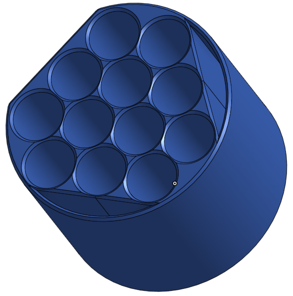
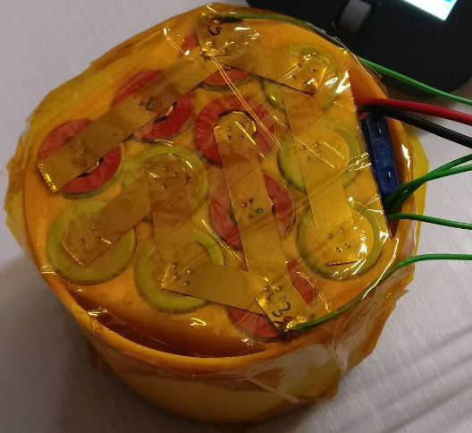
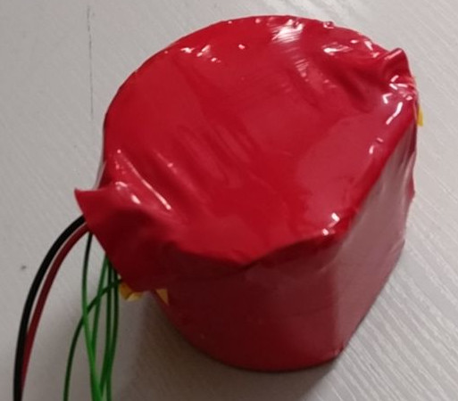
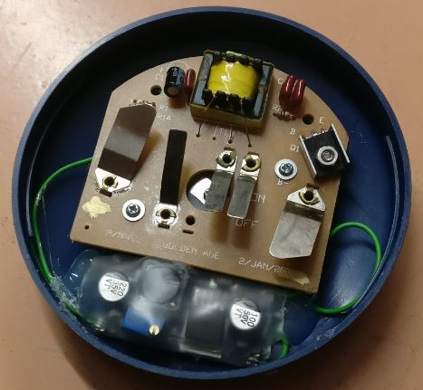
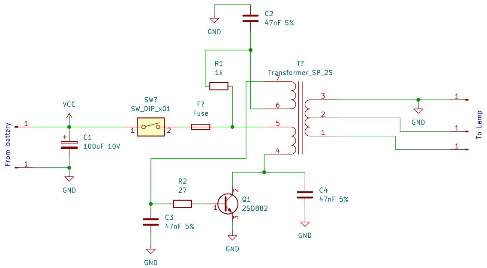
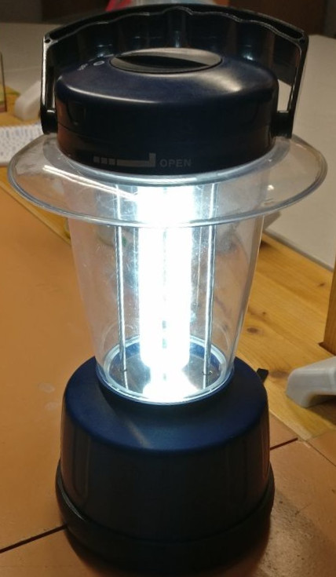
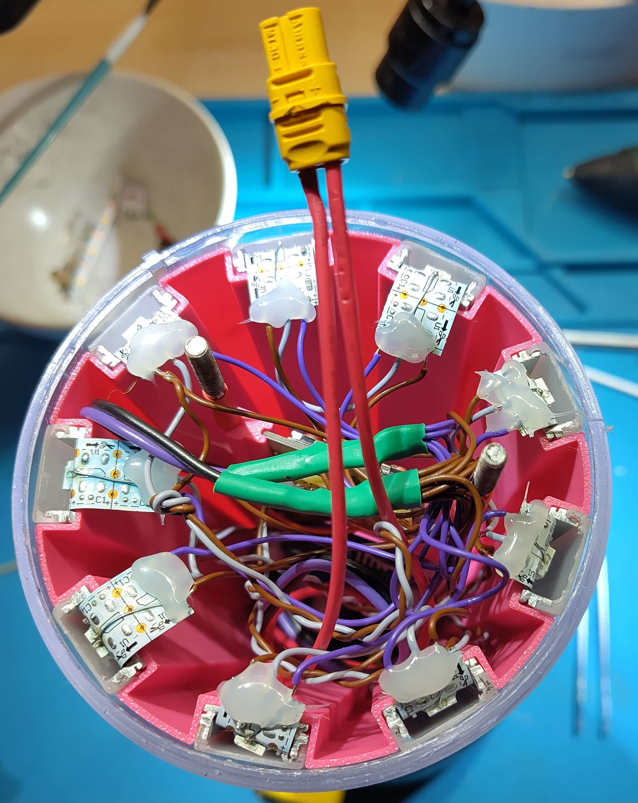
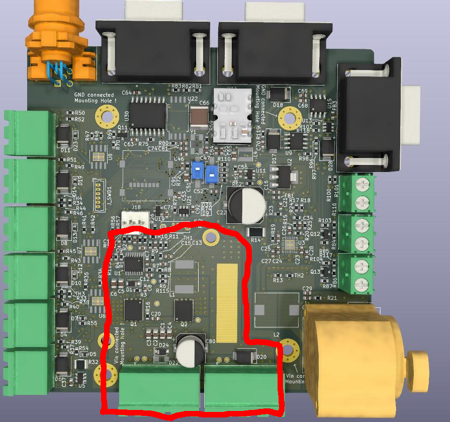
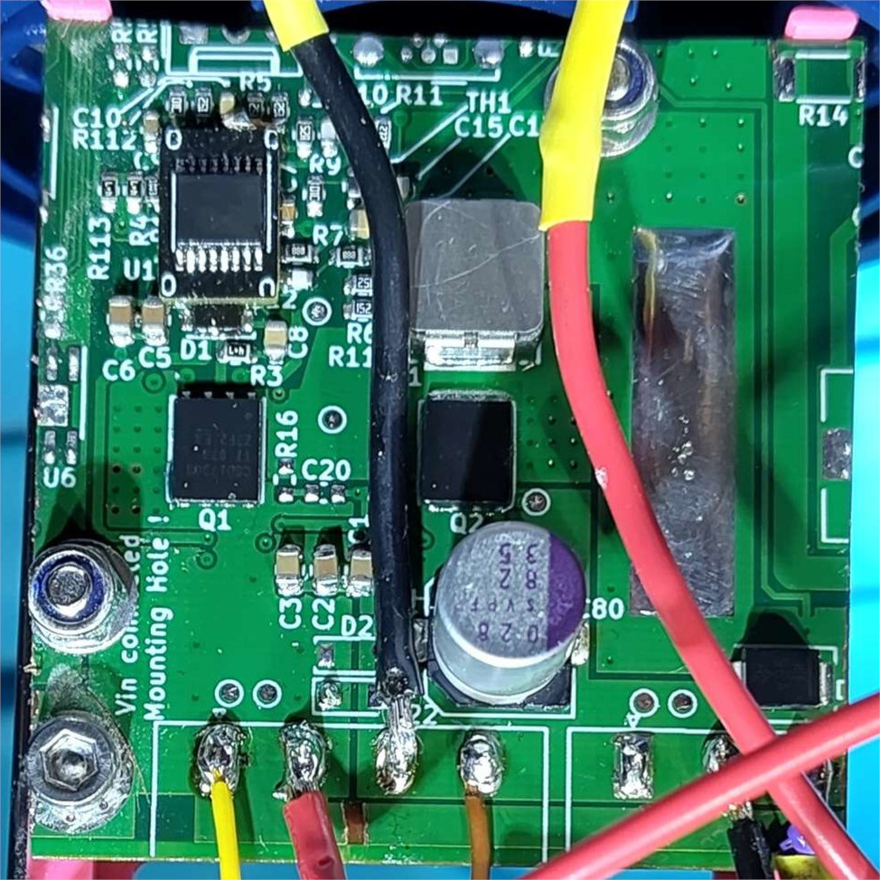

Hier möchte ich ein Projekt von mir vorstellen, was vielen Leuten im Hackerspace gefallen hat 
und vielleicht Inspiration für eigene Projekte sein könnte. Kurz zum Kontext: Bekannte haben 
bei sich aufgeräumt und mir eine elektrische Campinglampe gegeben die ein wares Produkt ihrer Zeit ist.
Im Boden befindete sich eine Batteriehalterung für 4 Alkaline C-Zellen, das Leuchtmittel war eine Energiespaarlampe und der An-Aus-Schalter war schon vom Hersteller aus wackelig und ließ das Licht flackern.
Wer C-Zellen kennt, weiß sicherlich dass diese auch als "Babyzellen" bekannt sind. Warscheinlich benannt wegen ihrer Ähnlichkeit zu Neugebohrenen zumindest in Größe und Gewicht. Kurz gesagt, wenn diese Lampe praktisch sein soll, muss etwas an Ihr passieren.

## Alles muss neu

Zur Übersicht liste ich hier alle Sachen auf, die ich modifiziert habe.

- Akku. Einwegbatterien ersetzt durch selbstbau Li-Ion Akku.
- Lampe. Leuchtmittel von Energiespaarlampe zu adressierbaren LED-Streifen umgebaut.
- Spannungsversorgung. Treiberelektronik der alten Lampe durch Schaltregler und ESP-32 mit WLED ersetzt.
- An-Aus Schalter. Kratzt nicht mehr auf einer Platine sondern betätigt einen Mikroschalter.
- (Ent-)Ladebuchse. Die Campinglampe ist jetzt auch eine Power-Bank

Dieses Projekt ist über viele Monate entstanden und ich habe immer, wenn etwas Zeit war, etwas dran gemacht.
Für mich persönlich war dieses Projekt meditativ fast schon Zen. Die Teilziele ließen sich klar Abstecken und 
hingen nicht groß von einander ab. Anders als bei den meisten Elektronikprojekten musste ich hier nicht mehrere Wochen angesträngt Debuggen oder mehrere Platinenrevisionen erstellen. Alles was es hier zu tun gab konnte 3d-gedruckt, gelötet und simpel im CAD erstellt werden.
Die Lampe hat es mir auch irgendwie angetan. Sie hat in Ihrer Ladenzeit sehr warscheinlich unter 50€ (oder DM) gekostet und war wegen ihres hohen Wegwerfbatterieverbrauchs, von Anfang an als schnellebiger Elektroschrott bestimmt. Als Hacker machen mir Projekte, die Dingen ein zweites Leben geben besonders viel Spaß.
Man hat, zumindest etwas, für die Umwelt getan und am Ende viel Geld gespaart für eine neue Lampe die nicht unbedingt die selben Features hat.

## Akku

Der Untere Teil der Lampe besteht aus einem blauen Gehäuse, einem Einsatz, einen Batterieträger für die Zellen und dem Bodendeckel. Ich kann mir vorstellen, das man dieses Produkt auch mit Nickelmetallhydrid- oder Bleiakku hätte kaufen können. Die Ladedauer ist bei beiden nur etwas für geduldige Personen. 
Wie dem auch sei, ich werde keine Wegwerfbatterien mehr kaufen und habe als erstes den Batterieträger nachmodelliert und 12 Löcher für 18650 Größe Li-Ion Akkus vorgesehen. 

Die Zellen sind vom Typ **TYP NACHPFLEGEN** und waren ein Impulskauf bei einem namenhaften, deutschen Akkuhändler und sind mit 2.5Ah leider unterbemessen (später mehr dazu). 
Die Zellen wurden mit 10mm Nickelstreifen zu einer 4s3p konfiguration verschweißt. Das Punktschweißgerät des Hackerspaces war an dieser stelle sein Geld wert. Am Ende habe ich noch eine fertige Battery-Management-Schaltung verbaut um den Akku vor Tiefenentladung zu Schützen und eine 7.5A Kfz-Sicherung vor die Hauptentladekabel gelötet. 
Aufgeladen wird der Akku, indem man den Bodendeckel abschraubt und den XT-60 Stecker der Hauptentladekabel an ein Ladegerät klemmt. Das Ladegerät muss dabei den Strom auf ugf. 5A begrenzen. **AKKUTDETAILS NACHPFLEGEN**
Das wurde schnell sehr nervig und ich habe noch nachträglich eine XLR Buchse angebracht. Mehr dazu später.

## die alte Lampe

Original war hier eine Energiespaarlampe verbaut, was mich ziemlich verblüfft hat. Diese Lampen benötigten hohe Spannung, die von einer Treiberplatine im abnehmbaren Kopfteil der Lampe bereitgestellt wurde.
Die Platine hatte fünf Federkontake. Batterie + und - und drei Kontakte zur Lampe.

[PDF](./blog-wled-camping-lamp/cfl_camping_lamp.pdf)

Ich habe mal die Platine nachgezeichnet um zu verstehen wie sie funktioniert. Sie ist schon ziemlich schlau gemacht. Wenn die Lampe eingeschaltet wird, wird die Basis von Q1 durch R1 und Spule 6,7 bestromt, dadurch fließt durch die Primärwicklung Strom, der ein magnetisches Feld aufbaut. Dieses geht dann größtenteils zur Sekundärseite (1,2,3) und damit zur Lampe, aber ein kleiner Teil geht in umgekehrter Richtung durch Spule 6,7 vom Anfang. Dies Schaltet Q1 wieder aus. Der Vorgang wiederholt sich, wenn das magnetische Feld schwach genug ist um wieder durch 6,7 Strom fließen zu lassen. 
So zumindest meine Interpretation der Schaltung. 

Um die Lampe überhaupt zu benutzen, habe ich einen temporären Schaltwandler verbaut, der aus den 17V Batteriespannung zu 6V für die Treiberschaltung macht. Dafür musste die Batterie + Leiterbahn geschnitten werden um den Ein- und Ausgang des Schaltwandlers einzuschieben. Mit dieser modifikation und dem neuen Akku konnte die Lampe jetzt komplett wieder benutzt werden und sie hat ein angenehmes, kaltweißes Licht erzeugt in guter Intensität. Ich hatte Sie so auf zwei Festivals mit und es war schon ziemlich praktisch eine Tischlampe in dem Formfaktor zu haben.

## die neue Lampe

Ich hätte hier aufhören können und es ist auch viele Monate nichts am Projekt passiert, es blieb jedoch wie ein Jucken im Hinterkopf, was nur durch ein fertiges Projekt gekratzt werden konnte. 
Sicher bin ich mir nicht, ob ich jemals weitergemacht hätte, wäre die Lampe nicht immer mehr kaputt gegangen. Der Schalter, wie Anfangs beschrieben, ließ die Lampe flackern und war irgendwann komplett durch die dünne Kupferschicht der Platine gestoßen. Ich konnte es immer temporär mit etws Lötzinn reparieren, aber war es Leid. Es war höchste Zeit den letzten "Rest" zu machen. 

Glücklicherweise hatte ich noch High-Density (144 LEDs / Meter) adressierbare LED Streifen rumliegen, die Perfekt für dieses Projekt waren. Ich habe viele verschiedene Ideen für die neue Lampe gehabt und wollte so viel wie möglich vom alten Design beibehalten. 
Die Energiespaarlampe ist U-förmig also warum nicht einen Kupferstreifen in U-Form biegen und innen und außen LED Streifen Anbringen? Keine Gute Idee, da die LEDs nur einen relativ schmalen Abstrahlwinkel haben und fast all ihr Licht nach vorne ausgeben. 
Ok, dann weg mit den LED Streifen und einfach einen Stab diffuses Material biegen und an die Oberkanten der beiden Enden hochleistungs LEDs anbringen! Wohin mit der Wärme und welches Material ist ein guter Diffusor in diesem Formfaktor? Zu viel zum rumprobieren für meinen Geschmack. Mir wurden auch noch LED-Nudeln empfolen [Adafruit nOOds](https://www.adafruit.com/product/5510), aber diese sind nicht adressierbar, einfarbig und benötigen eine Konstantstromquelle. 

Am Ende gab ich auf, die Lampe so original wie möglich aussehen zu lassen und begann einen "Kelch" zu designen, in dem dann Aluminiumprofile, speziell für LED-Streifen gemacht, eingeklebt werden. Diese werden dann rundherum angeordnet und aufwendig verlötet.
Die LED-Streifen Profile sind von Galaxy-Profiles (Produktnummer 8102062 und 8600005).

Der Kelch hat ein paar Revisionen benötigt, da ich die Toleranzen so wählen wollte, das er komplett Fertig in den durchsichtigen Teil der Lampe passt ohne zu klappern. 
Die LEDs bekommen von oben 5V, Minus und den die erste Datenleitung. Sie und Minus gehen dann von oben nach unten und dann zum nächsten vertikalen Abschnitt. Die gesamte Lampe ist dann als ein kontinuierlicher LED Streifen aufgebaut. 
Daten und Minus werden immer zusammen geführt um [Ringing](https://en.wikipedia.org/wiki/Ringing_(signal)) auf der Datenleitung zu vermeiden. LED Streifen haben zwar keine hohe Datenrate, aber dafür steile Flanken, die andere Geräte stören könnten bei unachtsamer Verdrahtung. 
Jeder Streifen bekommt außerdem seine individuelle 5V und Minus Leitung, damit Streifen am Ende nicht dunkler sind als die am Anfang. 
Von oben gesehen sah das dann folgendermaßen aus.

## `git cherry-pick` mit der Säge

Die LEDs sind verbaut, jetzt muss die richtige Spannung her. Für ein vorheriges Projekt musste ich einen Schaltregler auslegen, der von 12V zu 5V wandeln kann und 20A liefert. Davon waren einige PCBs über und der Wandler wäre perfekt für die Lampe. Nur leider hängt noch viel mehr auf der Platine, als unbedingt muss. Warum also nicht mit einer Säge alles entfernen was nicht unbedingt dort hin muss?

Gesagt, getan. Zusätzlich mussten noch ein paar Keramikkondensatoren durch spannungsfestere ausgetauscht werden. Das originale Design war schließlich nur bis 13V geeignet. 
Der Plan ging definitiv auf, leider ist der Leerlaufverbrauch von 100mA bei 17V schon ziemlich hoch. Ein Wandler, der kleiner ausgelegt wäre, hätte eine bessere Effizienz erzielen können.
Für alle, die sich für die Schaltung interessieren, hier ist der Plan. [PDF](./blog-wled-camping-lamp/step_down_pcb.pdf) Ich habe aber die Modifikationen für die 17V nicht eingetragen, der EN-Pin muss noch von der 12V Leitung getrennt werden und die Pinbelegung des TI LM27402 ist potentiell falsch. 
Abgesehen davon, funktioniert die geschnittene Platine sehr gut und sie war kostenlos. 

## LED Ansteuerung mit WLED

Adressierbare LEDs machen ohne Daten erstmal gar nichts, also muss etwas her, was die richtigen Signale generiert. 
Am Anfang wollte ich eigendlich gar nicht die LED Farben einstellbar machen und einfach nur einen einfachen Mikrocontroller verbauen der ein statisches Farbsignal ausgibt, aber das wäre verschenktes Potential. 
Leute aus dem Hackerspace zeigten mir [WLED](https://kno.wled.ge/) und das ist schon ein ziemlich cooles Projekt. Die Firmware läuft auf ESP-32 Chips und man verbindet sich dann mit einem WLAN Hotspot, der geöffnet wird. 
Schon irgendwie witzig, das meine Lampe WLAN hat.  

